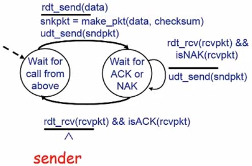

# 计算机网络

## 1. 计算机网络概述

### 1.1 计算机网络基本概念
#### 计算机网络
> 定义：
- 计算机网络就是互连的、自治的计算机集合
- 自治：无主从关系
- 互联：互联互通（通过链路将主机们连起来）
- 下图显示的是主机通过链路连接在一起，引入的设备：主机、链路

> 距离远、数量大如何保证互连？
- 这个时候使用直接链路去连是不可行的，可以通过交换网络，让主机和这些交换网络连在一起，这样每个主机只需要一个链路
- 引入的设备：主机、链路、交换机、路由器

#### Internet
> 什么是Internet？
- 1.组成细节上讲：是全球最大的互联网，是一个互联了遍及全世界数十亿计算设备的网络。他的组成主要包括：数以亿计的计算设备（PC、服务器等）、通信链路（光纤、同轴电缆等）、分组交换（路由器、交换机）
- ISP（Internet Service Provider）因特网服务提供商。端系统通过ISP接入因特网

- 2.服务角度讲：为网络应用（web、游戏等）提供通信服务的通信基础设施；为网络应用提供了应用编程接口，使得这些应用能够连到网上，或者说通过互联网实现数据的发送和接收。（就像邮政系统一样，能把我们的信件正确地送到目的地）

#### 协议
> 如果仅有硬件（主机、链路、路由器...），Internet能否顺畅运行？能保证应用数据有序交付吗？
- 显然不能，我们还需要网络协议！
- 硬件（主机、链路、路由器...）是计算机网络的基础；
- 计算机网络中的数据交换必须遵守事先约定好的规则，这个规则就是协议。（就像在交通系统中，如果只修好了道路，没有交通规则约束我们怎么有序行驶，那交通系统很可能会瘫痪）

> 网络协议（network protocol）
- 定义： 简称为协议，是为进行网络中的数据交换而建立的规则、标准或约定
- 干什么的：协议规定了通信实体之间所交换的消息的格式、意义、顺序以及针对收到信息或者发生的事件所采取的动作
- 总结：协议规范了网络中所有信息发送和接收的过程

> 协议的三要素
- 语法（Syntax）：规定了数据与控制信息的结构或格式（比如底层信息就是信号电平）
- 语义（Semantics）：规定了协议双方交换信息的过程中需要发出何种控制信息、完成何种动作以及做出何种响应
- 时序（Timing）：规定了协议双方通信所要遵循的时间顺序和速度匹配

### 1.2 计算机网路结构
#### 计算机网络的结构
> 计算机网络的结构
- 网络边缘：主机（或称端系统）
- 接入网络、物理介质：有线或无线通信链路
- 网络核心（核心网络）：网络的路由器或分组转发设备

#### 网络边缘
> 网络边缘
- 就是指主机（又叫端系统），因为他们位于因特网的边缘。
- 主机就是用来运行（容纳）网络应用程序的，网络应用的运行方式主要有两种：
- 1. 客户/服务器（client/server）应用模型：客户发送请求，接收服务器响应，如web应用，文件传输FTP应用
- 2. 对等（peer-peer，P2P）应用模型：通信在对等实体之间直接进行，没有客户端服务端之分，如qq 

#### 接入网络
> 接入网络
- 接入网络就是将网络边缘接入到核心网或边缘路由器的。（边缘路由器是端系统到任何其他远程端系统的路径上的第一台路由器），可分为三种：
- 1. 家庭接入网
- 2. 机构接入网络
- 3. 移动接入网络
- 不管哪种接入网络，用户关心的是：带宽（bps），即数据的传输速率（每秒传输多少比特）；接入方式是独占还是共享（独占即带宽为一人所用，共享即带宽是共同使用的）

> 家庭接入网常见的接入网络
- DSL接入网络（Digital Subscriber Line数字用户线）：利用家庭已有的电话线，使用多路复用技术，即多路信号共用一个物理介质来进行传输。数据通信通过DSL电话线接入Internet，语音（电话）通过DSL电话线接入到电话网。（使用的是FDM频分复用技术，不同的频段给不同的功能用，0~4khz为电话，4~50khz为上行数据，50khz~1Mhz为下行数据）。DSL是独占式的。

- 电缆因特网接入：利用有线电视网络，也是用频分多路复用技术（不同的频率代表不同的电视台）。住宅从提供有线电视的公司获得电缆因特网接入，光缆将电缆头端连接到地区枢纽，因为在这个系统中用到了同轴电缆和光纤，所以又叫混合光纤同轴（Hybrid Fiber Coax，HFC）系统。它也是非对称的，上行传输速率为2Mbps，下行为30Mbps。电缆接入一个重要特征就是他是共享的，各个家庭共享家庭至电缆头端的接入网络，不同于DSL独占至中心距的接入，所以电缆的带宽虽然比较高，但速度可能没有DSL的方式快

- 总结：典型的家庭网络的接入大致为下面这样：通过DSL调制解调器或者电缆调制解调器（cable modem）通过电话线或有线电视网连接到中心局或电缆头端；家庭端通常会部署一些路由器或防火墙进行地址转换等；通过以太网这种局域网连接计算机等设备；通过无线网络连接无线设备

> 机构接入网常见的接入网络
- 以太网接入：机构通常使用局域网（LAN）将端系统接入到边缘路由器，以太网是局域网中最流行的技术。以太网用户使用双绞铜线与一台以太网交换机相连，以太网交换机再与更大的因特网相连

- 无线接入网络：通过共享的无线接入网络连接端系统与路由器，通常分为两种：无线局域网（LANs），基于IEEE802.11技术的无线LAN接入，或称WIFI，通常30m内；广域无线接入，通过蜂窝网，如4G网络。下图为WIFI和蜂窝网

#### 网络核心
> 网络核心
- 网络核心就是由一些路由器互联构成的网络，网络核心的关键功能：路由+转发。
- 路由（routing）就是确定分组从源到目的地的传输路径
- 转发（forwarding）就是将分组从路由器的输入端口交换到正确的输出端口
- 本地转发表，又叫路由表

#### Internet的结构
> Internt的结构：
- 概括说Internet是一个网络的网络，即由很多网络互联以后构成的全球性的大的互联网。
- Internet的结构是由端系统通过接入ISP（access ISPs）连接到Internet；接入ISP必须进一步互相连接，保证任意两个主机可以互相发送分组；作为全球性的网络，有很多ISP网络连接了很多端系统，他们互联在一起，构成了复杂的网络互联的网络

> 数以百万的接入ISP是怎么互联在一起的呢？
- 可选方案一：直接互联在一起，不适合大规模网络

- 可选方案二：将每个接入ISP连接到一个国家或全球ISP

- 然而，从商业角度看，不可能全球构建一个ISP，一定有很多竞争者，不同的ISP连接不同的接入网络，不同的接入网络再连接不同的主机。要保证互联网的互联互通 ，这些ISP必须互联。互联的方式有两种：1.利用对等链路；2.引入第三方IXP互联网交换机

- 互联网的发展中还出现了另一种网络，区域网络（regional networks），连接接入ISP和运营商ISP

- 近几年还出现一种新的网络，内容提供商（content provider networks，如谷歌、微软等）可能运行其自己的网络，并就近为端用户提供服务、内容

- 总结：因此，Internet的结构大致可以这样描述：最上层是一级商业ISP（如网通、电信），提供国家或者国际范围的覆盖，内容提供商（如谷歌），私有网络，连接其数据中心与Internet，通常绕过一级ISP和区域ISPs；下边可能还有二级ISP甚至三级ISP，然后再连接区域ISP，再连接接入ISP，再连接主机

### 1.3 网络核心
#### 网络核心
> 网络核心的定义
- 网络核心就是互联的路由器网络
- 网络核心解决的问题就是如何将原主机发送的数据成功地通过网络核心送达正确的目的主机

> 网络核心的由来
- 如果任意两台主机需要通信，最简单的解决方案就是直接互联，但是会带来O(N^2)的链路，假设有N个主机，每个主机之间相互连接则需要N*（N-1）/2条链路；

- 解决方法：引入一个交换设备，但是如果主机数量特别多，交换设备的端口需要特别多；如果主机间距离特别远也很难都连到一个交换设备上

- 解决方法：把交换设备互联在一起，构成一个交换网络，交换网络帮我们进行数据转发

> 如何实现数据通过网络核心从源主机到达目的主机？
- 通过数据交换
- 数据交换可以分为三类：电路交换、报文交换、分组交换

#### 电路交换
> 电路交换（circuit switching）
- 电路交换最典型的例子就是电话网络
- 当一个人通过电话网想另一个人打电话时，该网络必须在发送方和接收方之间建立一个连接，该连接被称为一条电路（circuit），沿着放松放松到接收方路径上的交换机都将为该链接维护连接状态。
- 电路交换的三个阶段：建立连接、通信、释放连接

- 电路交换最显著的特点是资源独占，建立电路所占有的通信资源，比如信道资源，不能被第三方共享

> 电路交换网络中如何共享中继线？
- 通过多路复用技术：链路/网络资源（如带宽）被划分为“资源片“，将资源片分配给各路，每路独占分配到的资源片

- 常用的技术：频分复用（FDM）、时分复用（TDM）、波分复用（WDM，复用波长）、码分复用（CDM）
- 码分复用：各用户码片序列相互正交，即点积为0；同一用户码片内积为1。方便在接收方解码的时候通过内积就能求出码数（如用户A的码片为A，用户B的为B，则A*B=0，B*B=1；A和B同时传输，B端在接收时计算（A+B）*B = 1，就知道B传输的是1）

#### 报文交换
> 报文交换
- 报文：源（应用）发送的信息整体
- 典型应用：电报

#### 分组交换
> 分组交换（package switching）
- 分组：源将报文划分为较小的数据块，称之为分组（package），每个小数据块通常还会加上一个头部信息，主要是一些控制信息，如地址信息
- 分组交换使用统计多路复用，A、B分组顺序不确定，按需共享链路，需要发送数据就占用链路的带宽，不需要就不占用，路由器按照分组到达的先后顺序把分组发出去，对下图每个分组都是按照1.5 Mbps的速度发送

> 存储转发传输：
- 路由器要把整个分组接收下来，暂存一下，然后确定把他从哪个链路发出去，并且那个链路现在可用，那么再进行发送。
- 报文交换和分组交换均采用存储转发传输，区别是报文交换以完整的报文进行存储转发，分组交换以较小的分组进行存储转发
- 哪种交换更好呢？
#### 传输延迟
> 传输延迟
- 传输延迟：发送一个分组的第一个比特开始到发送完最后一个比特结束，这段时间成为传输延迟（时延）
- 假设分组长度L bits，传输带宽R bps，传输延迟为L/R

#### 报文交换 VS 分组交换
> 传输延迟：报文交换 VS 分组交换
- 报文交换：报文长度M bits，链路带宽R bps，每次传输报文需要M/R秒
- 分组交换：报文被拆分成多个分组，分组长度L bits，每个分组传输时延为L/R秒
- 例：M = 7.5 Mbits， L = 1500bits， M = 5000L， R = 1.5 Mbps

- 报文交换：交付时间为 3*（7.5/1.5） = 15秒，且路由器至少需要7.5M的缓存
- 分组交换：在路由器间进行一次传输需要（1500bit/1.5Mbps）=1ms，所以在第4999ms的时候，第4999个分组刚到达第一个路由器，准备发往第二个路由器；第5000个分组正准备从源主机到第一个路由器，所以一共需要5002ms，此时最后一个分组刚好到达目的主机，即5.002秒，分组交换只用了报文交换几乎1/3的时间
- 结论：分组交换的交付时间：假设报文大小M bits，带宽R bps，分组长度L bits，跳步数h，交换机数n(n = h-1)，则交付时间T = M/R + （h-1）L/R = M/R + nL/R，即整个报文一次跳步的传输时间  + 最后一个分组n次的传输时间

#### 分组交换 VS 电路交换
> 分组交换 VS 电路交换
- 1.电路交换使用FDM的情况：假设共享链路带宽为1 Mbps，每个用户活动时需要100 kbps，每个用户平均活动时间为10%
- 电路交换：能支持10个用户同时活动
- 分组交换：允许更多的用户同时使用网络，资源共享率更高。（当有10个或更少的用户活跃时，通过该链路的分组流基本没有时延，和电路交换情况一样；当同时活跃的用户数超过10个，分组的聚合到达速率超过该链路的输出容量，则输出缓存开始变长。然而10个用户同时活跃的概率较小）
- 2.电路交换使用TDM的情况：假设链路带宽1 Mbps，每帧有10个时隙，每个时隙包含1000比特，有10个用户，其中一个用户突然产生1000个1000比特的分组
- 电路交换：活跃的这个用户只能使用每个帧中的1个时隙来传输数据，剩余9个时隙空闲，1Mbps/（1000bit*10） = 100帧/秒，链路每秒能传输100帧，总共传完这些数据需要1000帧，所以要花费1000帧/（100帧/秒）=10秒
- 分组交换：活跃用户可以连续地使用1 Mbps的带宽，（1000*1000bit）/1 Mbps = 1秒
- 分组交换绝对优于电路交换？不是

> 分组交换
- 分组交换适用于突发数据传输网络，可以让资源充分共享，且简单、无需建立呼叫。现在广泛使用的Internet就是分组交换网络。
- 缺点：因为在通信前没有预约或占用网络的链路或资源，可能出现很多用户大量向网络中发送数据，超越了网络的传输能力，会出现拥塞（congestion）现象，导致分组延迟和丢失
- 所以需要协议处理可靠数据传输和拥塞控制

> 电路交换
- 电路交换更适合实时交互通信。（因为分组交换的端到端时延是可变的和不可预测的）

### 1.4 计算机网络性能
#### 速率
> 速率
- 速率，又叫数据率、数据传输速率或比特率
- 指单位时间（秒）内传输的信息量（bit）
- 单位：b/s（或bps）、kbps、Mbps、Gbps，每个数量级差1000

#### 带宽
> 带宽
- 通信中的带宽是信息最高频率与最低频率之差，单位是hz
- 网络中的带宽是数字信道所能传输的最高数据率，单位bps

#### 延迟/时延（delay/latency）
> 分组交换为什么会发生丢包和时延？
- 数据分组到达路由器，先暂存，确定这个分组在哪个链路进行转发时，再去转发，如果该链路正在转发其他的分组，这个分组就得排队等着，如果该链路的队列满了，就会发生丢包

> 四种时间延迟
- 处理时延d_proc：包括检查分组首部并决定将该分组的输出链路、差错检测等等，通常小于毫秒级别
- 排队时延d_queue：分组在链路的队列（也称为缓存）中等待传输的时间。不同于其它的时延，排队时延使不确定的，取决于路由器的拥塞程度，即流量到达的速率、链路的传输速率及流量是周期性到达还是突发地到达
- 传输时延d_trans：将分组的所有比特推向链路所需要的时间，d_trans = L/R，L为分组长度（bit），R为链路带宽（bps）
- 传播时延d_prop：一旦一个比特被推向链路，该比特需要向下一个路由器传播，从该链路的起点到下一个路由器传播所需要的时间为传播时延，跟物理链路长度和信号传播速度有关
- 节点的总时延d_nodal：d_nodal = d_proc + d_queue + d_trans + d_prop

> 排队时延与流量强度
- 假设a是分组平均到达速率（pkt/s），R是传输速率（bps），每个分组有L个比特，则比特到达队列的平均速率是La bps，流量强度为La/R
- La/R 接近 0：平均排队延迟很小
- La/R 接近 1：平均排队延迟很大
- La/R 大于 1：平均排队延迟无限大

#### 时延带宽积
> 定义
- 时延带宽积 = 传播时延 * 带宽 = d_prop * R (bits)
- 发送的第一个比特到了目的路由器时一共发出了多少个比特，或者链路上能容纳多少比特。所以时延带宽积又称为以比特为单位的链路长度

#### 丢包
> 丢包
- 一条链路前的队列容量是有限的，分组到达已经满了的队列时将会被丢弃
- 丢弃分组可能由前序节点或源重发，也可能不重发
- 丢包率 = 丢包数 / 已发送分组总数

#### 吞吐量/率（Throughput）
> 吞吐量/率
- 表示在发送端与接收端之间传送数据速率（bps）
- 瞬时吞吐量：给定时刻的速率
- 平均吞吐量：一段时间的平均速率
- 瓶颈链路：端到端的路径上，限制端到端吞吐量的链路（类似于木桶效应，取决于那个最差的）
- 场景1：若Rs < Rc，则端到端的理想吞吐量为Rs，若Rc < Rs，则端到端的理想吞吐量为Rc（先忽略丢包问题）。即吞吐量为min{Rs，Rc}，即瓶颈链路的传输速率。

- 场景2：每条连接的端到端吞吐量为min{Rc，Rs，R/10}，然而在实际网络中，通常Rc或Rs是瓶颈，即接入链路通常是瓶颈

### 1.5 计算机网络体系结构

#### 概述
> 为什么需要计算机网络体系结构
- 计算机网络是一个非常复杂的系统，设计许多组成部分，如主机、路由器、各种链路、应用、协议、硬件、软件...
- 是否存在一种体系结构有效地描述网络：分层结构

> 计算机网络的体系结构
- 计算机网络的体系结构是从功能上描述计算机网络的
- 每层遵循某些网络协议完成本层的功能，并为上层提供服务
- 总结：计算机网络的体系结构是计算机网络的各层及其协议的集合。体系结构是一个计算机网络的功能层次及其关系的定义，是抽象的

> 分层结构优点
- 结构清晰
- 模块化的分层易于系统更新、维护
- 有利于标准化

> 分层结构缺点
- 分层太多导致效率低

#### 基本概念
> 分层网络体系结构基本概念

- 实体（entry）：表示任何可发送或接受信息的硬件或软件进程
- 协议：是控制两个对等实体（相同层次）进行通信的规则的集合，协议是水平的
- 服务：下层实体向上层提供服务，服务是垂直的。下层协议的实现对上层服务用户是不可见的
- 同系统的相邻实体间通过接口进行交互，通过服务访问点SAP（Service Access Point）交换原语，指定请求的特定服务

#### OSI参考模型
> 概述
- 开放系统互连（OSI）参考模型是由国际标准化组织ISO于1984年提出的分层网络体系结构模型，目的是支持异构网络体系的互联互通。
- 是理解网络通信的最佳理论模型，然而，理论成功，市场失败

> OSI通信过程

- 主机需要7层，路由器只需要完成后3层，上面4个层称为端到端层，下面三层为非端到端层
- 实线是数据的真正的流动方向，虚线是规定对等层之间如何交换数据，不是物理上的数据交流
- 相邻层之间通过接口提供服务

> 数据封装

- 数据封装是为了给数据加控制信息，构造成协议数据单元（PDU）
- 控制信息主要包括：
- 地址（Address）：表示发送端、接收端
- 差错检测编码（Error-detecting code）：用于差错检测或纠正
- 协议控制（Protocol control）：实现协议功能的附加信息，如优先级（priority）、服务质量（QoS）、安全控制等

> 物理层
- 功能就是在具体的物理介质上实现每一个比特的传输，主要规定的有：
- 接口特性：1.机械特性：接口的几何形状；2.电气特性：使用多高的电压等；3.功能特性：接口有多少引脚，每个引脚的功能；4.规程特性：接口在工作过程中要遵循什么过程，哪个引脚先给一个信号，哪个引脚再给反馈信号等
- 比特编码：采用什么编码技术
- 数据率：以多快的速度发送数据
- 比特同步：时钟同步问题
- 传输模式：单工、半双工、全双工

> 数据链路层
- 负责结点到结点的数据传输，以帧（frame）作为单位传输，主要功能有：
- 组帧：加头加尾，如在帧头添加发送、接收方的物理地址（MAC地址）
- 物理寻址

- 流量控制：避免淹没接收端
- 差错控制：
- 访问控制：在任一时刻决定那个设备拥有链路控制使用权

> 网络层

- 负责源主机到目的主机数据分组（package）的交付，主要功能有：
- 逻辑寻址：全局唯一逻辑地址，确保数据分组被送达目的主机，如Internet中的IP地址
- 路由
- 分组转发：字母表示网络层的唯一逻辑地址，绿色数字是物理地址，在这个过程中源和目的的网络层地址是不变的

> 传输层

- 负责源到目的进程间完整的报文传输
- 分段和重组：在发送端分段，发出去，在目的地在组装在一起
- SAP寻址：确保将完整的报文提交给正确的进程，如端口号。下图x、y为端口号，S、D为ip地址，DH中有物理地址

- 连接控制：端到端的连接的建立、维护和拆除，传输层的连接是逻辑连接
- 流量控制
- 差错控制

> 会话层

- 不会对来自表示层的数据进行分割，只是在其中插入一些控制信息
- 对话控制：对话的建立和同步
- 同步：在数据流中插入“同步点”，如果数据传输在某个同步点附近中断，下次恢复时只需恢复到最近的一个同步点
> 表示层

- 处理两个系统间交换信息的语法和语义问题，主要功能有：
- 数据表示转化：不同计算机系统数据表示可能有所不同，问了解决这个问题，表示层在发送数据一端把数据转换成一个独立的编码，跟具体系统无关，目的主机收到后再转换为本系统的编码
- 加密解密
- 压缩解压缩

> 应用层

- 支持用户通过用户代理（浏览器）或网络接口使用网络（服务）

#### TCP/IP参考模型
> TCP/IP
- 四层：应用层、运输层、网际层、网络接口层
- Internet就是基于TCP/IP协议，把网络接口层展开就变为五层参考模型

#### 五层参考模型
> 五层参考模型
- 五层：物理层、数据链路层、网络层、传输层、应用层
- 应用层：支持各种网络应用，FTP、SMTP、HTTP
- 传输层：进程-进程的数据传输，TCP、UDP
- 网络层：源主机到目的主机的数据分组路由与转发，IP
- 链路层：相邻网络元素（主机、交换机、路由器等）的数据传输
- 物理层：比特传输

> 五层模型的数据封装
- 应用层：发送的数据称为报文message
- 传输层：对报文拆分，加上段头，构造成段（segment），segment中携带源端口号和目的端口号
- 网络层：加上网络层的头部构造为数据报datagram，datagram中携带源ip地址和目的ip地址
- 链路层：加头加尾构造为数据帧frame
- 物理层：变成比特

### 1.6 计算机网络发展历史
- 1961-1972：早起分组交换原理的提出与应用
- 1972-1980：网络互联，大量新型、私有的网络涌现
- 1980-1990：新型网络协议与网络的激增，其中1983年部署了在ARPAnet上TCP/IP
- 1990-2000s：商业化，Web，新应用。其中1992年因特网协会ISOC成立，1990s后期出现了web应用
- 2005-今：宽带接入的快速部署、高速无线接入、服务提供商创建自己的专用网络

## 2. 应用层

### 2.1 基本原理
#### 网络应用的体系结构
> 客户机/服务器结构（Client-Server，C/S）
- 服务器：不间断地向外提供服务，永久性访问地址/域名，利用大量服务器实现可扩展性
- 客户机：与服务器通信，使用服务器提供的服务，可以间歇性地接入网络，可以使用动态IP地址，不会与其他客户机直接通信
- 例子：Web服务（在服务器上运行Web服务器软件，在客户机运行浏览器）
> 点对点结构（Peer-to-peer，P2P）
- 没有永远在线的服务器，任意端系统/节点之间可以直接通信
- 节点可以间歇性得接入网络
- 节点可能改变IP地址
- 例子：文件共享（BitTorrent），因特网视频会议（Skype）
- P2P优点高度可伸缩，缺点难于管理
> 混合结构（Hybrid）
- 例子：Napster应用
- 文件传输用P2P结构
- 文件搜索用C/S结构

#### 网络应用进程通信
> 进程
- 进程就是主机上运行的程序
- 同一主机上进程通过进程间的通信机制来通信（具体看操作系统这门课）
- 不同主机上的进程通过消息交换（报文交换）通信，发送进程生成并向网络中发送报文，接收进程接收这些报文，并可能通过回送报文进行响应
- 在一对进程间的通信会话场景中，发起通信的进程称为客户机进程，等待通信请求的进程称为服务器进程

> 套接字Socket
- 进程通过一个称为套接字的软件接口向网络中发送报文和从网络中接收报文，套接字是同一台主机内应用层与传输层之间的接口，通过把报文发送进套接字实现网络进程间的相互通信
- 进程类似于房子，套接字类似于门，当一个进程想向位于另一台主机的另一个进程发送报文时，需要把报文推出该门（套接字）
- 由于套接字是建立网络应用程序的可编程接口，因此套接字也称为应用程序和网络之间的应用程序编程接口（Application Programming Interface，API）。应用程序的开发者可以控制套接字在应用层端的一切，而对套接字的运输层端几乎没有控制权（对运输层的控制权仅限于选择运输层协议、设定运输层参数等）

> 进程寻址
- 主机寻址需要IP地址标识，主机上进程的地址需要端口号（Port number）
- 进程的标识符：IP地址 + 端口号

#### 应用层协议
> 应用层协议
- 定义了运行在不同的端系统上的应用称呼如何互相传递报文
- 其中公开协议是由RFC文档定义的，如HTTP协议，公开协议的好处是允许互相操作；私有协议部位公共域使用，如P2P文件共享应用

> 应用层协议的内容，即应用层协议规定了：
- 交换的报文类型：如请求报文还是响应报文
- 各种报文类型的语法：如报文中的各个字段及这些字段是如何描述的
- 字段的语义：字段中信息的含义
- 规则：如进程什么时候发送消息，如何对消息进行响应

#### 网络应用的需求
> 大体从以下四个方面对应用程序服务的需求进行分类：
- 数据丢失和可靠性问题：某些网络应用能够容忍一定的数据丢失，如网络电话，某些网络应用需要100%可靠的数据传输，如文件传输
- 带宽/吞吐量：某些应用只有在带宽达到最低要求时才有效，如看视频，某些应用能适用任何带宽，如email
- 时间/延迟：有些应用只有在延迟足够低时才有效，如网络电话
- 安全性：某些应用需要满足安全性，如网上银行
- 常见的应用的需求：

#### 传输层服务
因特网为用户提供了两个运输层协议：
> TCP服务
- 面向连接：客户机、服务器进程间需要建立连接，这个连接是全双工的
- 可靠的传输：可以把数据不丢包、无差错、不乱序地传输过去
- 流量控制：发送方不会发送速度过快，超过接收方的处理能力
- 拥塞控制：当网络负载过重时能限制发送方的发送速度
- 不提供时间/延迟保障
- 不提供最小带宽保障
> UDP服务
- 无连接
- 不可靠的数据传输
- 不提供可靠性保障、流量控制、拥塞控制、延迟保障、带宽保障

> 常见的应用使用的协议

### 2.2 Web应用
#### Web和HTTP
> Web应用
- World Wide Web（万维网），构成要素为网页和网页间的互相链接，从而成为一个极其强大的信息网络
- 网页包含多个对象，如html文件、图片、视频等
- 对象的寻址使用统一资源定位符（Uniform Resource Locator，URL），基本格式是：协议://host name/path
> HTTP
- HTTP在传输层使用TCP协议
- HTTP是无状态的，即服务器不维护任何有关客户端过去所发送请求的信息

#### HTTP协议
> HTTP的两种连接类型
- 非持久性连接：每个TCP连接最多允许传输一个对象，即每个TCP连接在服务器发送一个对象后就关闭，该连接不为其他对象持续，在HTTP1.0中使用
- 持久性连接：每个TCP连接允许传输多个对象，即服务器在发送响应后保持该TCP连接打开，后续的请求和响应报文能够通过相同的连接进行传送，在HTTP1.1中使用

#### HTTP报文格式
> 请求报文

- 请求报文使用ASCII码书写的，人可直接读，如上图所示
- 第一行是请求行，格式为：方法（get、post...） + URL + HTTP版本
- 后边是首部行，格式为：首部字段名：值，比如Connection：close表示浏览器告诉服务器在发送完被请求的对象后就关闭该TCP连接（TCP连接都建立了还需要在HTTP中写要请求的主机吗？这个信息在缓存和代理服务器时需要用）
- 后边是一个空行，空行后边可以跟实体体（entity body），使用get方法时实体体为空，使用post方法时才使用该实体体
- 详细格式见下图：sp为空格，cr lf为回车换行

- 表单向服务器发送数据的方法：一是用post发，那么表单的输入将写在实体体重发送给服务器；二是使用get发，那么表单的输入将通过request行的URL字段上传，如www.sdu.com/name=sdu&yaer=120 。（spring获取get、post的参数，见博客https://www.cnblogs.com/xiaoxi/p/5695783.html 、https://cloud.tencent.com/developer/article/1460969）
- 其他常用的方法还有：put，把实体体中的文件上传到URL字段锁指定的路径；delete，删除URL字段所指定的文件；head，与get类似，会用一个HTTP报文响应，但不会返回请求对象（常用于调试跟踪）

> 响应报文

- 上图为HTTP的一个响应报文，同样是用ASCII码书写的
- 第一行为初始状态行，包括 协议版本字段、状态码、相应状态信息
- 后边跟着6个首部行：Connection：close告诉客户发送完报文后将关闭该TCP连接，Date为服务器产生并发送该报文的时间；Server为服务器软件的类型；Last-Modified为对象创建或最后修改的时间；Content-Length为被发送对象的字节数；Content-Type知识了实体体中的对象是html文本
- 然后是一个空行，后边是实体体

> HTTP常见响应状态码
- 200：请求成功
- 301：被请求的对象已永久转移，新的URL定义在响应报文首部行的Location中，客户软件将自动获取该URL
- 404：被请求的对象不再服务器上
- 400：该请求不能被服务器理解
- 505：服务器不支持请求报文使用的HTTP版本

#### cookie技术
> 为什么需要cookie
- HTTP是无状态的，但是很多应用需要服务器掌握客户端的状态，如网上购物
- cookie是某些网站为了辨别用户身份、进行session跟踪而存储在用户本地终端上的数据（通常经过加密）

> cookie的组件
- HTTP响应报文中有一个cookie首部行
- HTTP请求报文中有一个cookie首部行
- 用户端系统中保留有一个cookie文件，由用户的浏览器进行管理
- web服务器端的后台数据库

> cookie流程
- 假设李华用同一台PC访问网站，假设他之前访问过ebay的网站，则他PC的浏览器cookie文件中会有一个ebay对应的cookie数据
- 假设他之前没访问过Amazon，则他第一次访问Amazon网站时，会发送一个常规的HTTP请求，不带cookie行
- 当服务器收到该请求后，发现对方之前没访问过，会为对方创建一个唯一识别码，作为数据库的一个表项，并通过响应报文的set-cookie响应给浏览器
- 浏览器收到响应后，会看到这个set-cookie行，并在自己的cookie文件中添加对方服务器的主机名和对应的cookie id
- 再次访问Amazon时，会在请求报文中带上cookie id，则服务器就可以根据cookie id跟踪客户的动作

#### web缓存/代理服务器
> web缓存/代理服务器技术概述
- web缓存器，又叫代理服务器，一般由ISP架设
- 功能：在不访问服务器的前提下满足客户端的HTTP请求
- 优点：缩短客户请求的响应时间；减少机构/组织的接入链路到因特网的流量；在大范围内实现有效的内容分发

> 流程

- 浏览器创建一个到Web缓存器的TCP连接，并发送HTTP请求
- web缓存器检查本地是否有请求的对象的副本，如果有，就用HTTP响应报文返回该对象
- 如果没有，就打开一个与该对象的初始服务器的TCP连接，发送HTTP请求。初始服务器收到请求后，向该web缓存器发送具有该对象的HTTP响应
- web缓存器收到该对象后，在本地存储空间存储一个副本，并向客户浏览器用HTTP响应报文发送该副本
- 因此web缓存器既充当客户端，又充当服务器

> 条件get方法
- web缓存器中缓存的对象可能是陈旧的，为了保证web缓存器缓存的对象和远端服务器上的对象一致，可以使用条件get方法
- 条件get方法的格式：请求报文用get方法，且请求报文中包含一个“If-Modified-Since：”首部行，表示持有的旧版本的日期
- web缓存器使用条件get请求服务器上的对象，如果请求的对象没有更改过，则相应消息中用状态码304声明，且实体体内不包含对象，这样不发送对象可以减少带宽的使用
- 如果请求的对象更改过，就把修改后的对象发过去

### 2.3 Email应用

> Email应用的构成组件
- 邮件客户端（user agent）：负责读、写email消息，与服务器交互，收、发email消息
- 邮件服务器：
- SMTP协议：邮件服务器之间传递消息所使用的协议。SMTP有两部分，为发送消息的客户端和接收消息的服务器端，每台邮件服务器上既运行SMTP的客户端也运行SMTP的服务器端

> 邮件服务器
- 邮箱：为每个用户分配一个邮箱，用来存储发改该用户的email，这样当我们不在线的时候，别人也可以给我们发邮件
- 消息队列：存储等待发送的email

> 为什么要用邮件服务器而不用我们自己的PC呢
- 如果对方的PC关闭了就没办法发送成功，而邮件服务器是常开的
- 如果用发送方PC直接发则没办法到达一个不可达的目的接受服务器

> SMTP协议
- 使用TCP进行email消息的可靠传输，端口是25
- 采用命令/响应交互模式，命令（command）是ASCII文本，响应（response）是状态码和语句
- email消息只能包含7比特ASCII码。如果发送二进制多媒体数据时，SMTP发送邮件前需要把二进制多媒体数据编码为7位ASCII码，接收端需要把ASCII码还原为多媒体数据

> Email发送接收邮件示例

- 1.A调用他的又见代理程序，并提供B的邮件地址，然后只是用户代理发送该报文
- 2.A的用户代理将报文发送给他的邮件服务器，该报文会被放在邮件服务器的报文队列中
- 3.运行在A的邮件服务器上的SMTP客户端创建一个到运行在B的邮件服务器上的SMTP服务器端的TCP连接
- 4.经过一些初始SMTP握手后，SMTP客户端通过该TCP连接发送A的报文
- 5.B的邮件服务器上的SMTP服务器端接收到该报文，将该报文放到B的邮箱中
- 6.B方便的时候就可以调用用户代理阅读该报文
- 注意：SMTP一般不使用中间邮件服务器发送邮件，即使这两个邮件服务器位于地球两端

> SMTP特点
- 使用持久性连接
- 要求消息必须由7比特ASCII码构成
- SNTP服务器利用回车换行.回车换行确定消息结束

> SMTP VS HTTP
- HTTP主要是拉协议（poll protocol），主要从服务器拉取信息；SMTP基本是一个推协议（push protocol），主要是把文件推向接收邮件的服务器
- SMTP要求报文都是7比特的ASCII码格式，HTTP没有这种限制
- 处理既包含文本又包含图片等其他类型的媒体的文档时，SMTP把所有对象放在一个报文中，HTTP把每个对象封装在独立的HTTP响应报文中
- 都使用命令（请求）/响应交互模式，命令和状态码都是ASCII码

> 邮件报文格式
- 格式是首部行 + 空行+ 报文体，首部行的格式为关键词：值
- 首部行中必须包含From：和To：
- 通过在首部行增加额外的行声明MIME（多媒体邮件扩展）的内容类型。

- 上图为把图片的原始数据，使用base64编码方法编码为ASCII格式，然后传输，消息到达后，可以将ASCII解码

> 邮件访问协议：从服务器获取邮件
- 接收方不能使用SMTP得到保温，因为获取报文是拉操作，而SMTP协议是推协议。可以使用的协议有：
- POP3（第三版邮局协议，Post Office Protocol-Version3）：认证/授权和下载
- IMAP（因特网邮件访问协议）：更多功能，更复杂，能操纵服务器上存储的消息
- HTTP协议：163、QQ mail等

> POP3协议

- 当用户代理代开了一个到邮件服务器110端口的TCP连接后，POP3就开始工作了。POP3按照以下三个阶段进行工作：
- 认证阶段：客户端命令：user 用户名，生U命用户名；pass 密码，声明密码。服务器响应：+OK表示合法用户，-ERR表示非法用户
- 事务阶段：用户可以使用的命令有：list，列出所有存储的报文的长度；retr，用编号获取消息；dele，删除消息；quit，退出。
- 更新阶段：
- POP3协议常用的两种模式：下载并删除模式，下载到客户端后就删除邮件服务器上的邮件；下载并保持模式，下载后不删除邮件服务器上的邮件
- POP3协议是无状态的。

> IMAP协议

- 所有消息统一保存在一个地方；服务器
- 允许用户利用文件夹组织消息：IMAP协议为用户提供了在服务器上创建文件夹以及将邮件从一个文件夹移动到另一个文件夹的命令
- 提供了允许用户代理获取报文某些部分的命令，这个特性对于低带宽连接比较有用

> HTTP协议

- 用户代理就是普通的浏览器，用户和远程邮箱之间的通信通过HTTP协议进行
- 发送到邮件服务器和从邮件服务器读取邮件用HTTP协议，邮件服务器之间发送和接收邮件时使用SMTP协议

### 2.4 DNS应用

#### 概述

> DNS概述

- DNS（Domain Name System），域名系统，解决了互联网上主机/路由器的识别问题
- 识别主机有两种方法：主机名（hostname，如www.baidu.com）或ip地址（如225.0.0.2）。人类喜欢用便于记忆的主机名，而计算机喜欢定长的、有层次结构的ip地址
- DNS就是一种能进行主机名到ip地址转换的目录服务

> DNS的主要任务

- 一个由分层的DNS服务器实现的分布式数据库
- 一个使得主机能够查询分布式数据库的应用层协议

> DNS的服务：

- 域名向ip地址的翻译
- 主机别名
- 邮件服务器别名
- 负载均衡：web服务器

#### DNS原理

> 为什么不用集中式的DNS？

- 单点失败问题：如果DNS服务器崩了，整个因特网都会瘫痪
- 流量问题：流量太大，一台服务器撑不起来
- 距离问题：当个DNS服务器无法邻近所有查询客户
- 维护性问题：单个DNS服务器得为每个新添加的主机频繁更新

> 分布式层次数据库

- 第一层：根DNS服务器，根域名提供顶级域DNS服务器的ip地址，全球有13个根域名服务器
- 第二层：顶级域DNS服务器（TLD，top-level domain），如com、org、edu等，提供了权威DNS服务器的ip地址
- 第三层：权威DNS服务器，提供组织内部服务器的解析服务

> 查询过程：www.amazon.com

- 客户端查询跟服务器，找到com域名解析服务器
- 客户端查询com域名解析服务器，找到amazon.com域名解析服务器
- 客户端查询amazon.com域名接续服务器，获得www.amazon.com的ip地址

> 本地域名解析服务器

- 不属于层级体系，每个ISP都有一台本地DNS服务器（也叫默认域名解析服务器）
- 主机一般具有一台或多台其本地DNS服务器的ip地址，当主机进行DNS查询时，查询被发送到本地域名服务器，本地域名服务器作为代理，将查询转发给层级式域名解析服务器

#### DNS查询示例

假设cis.poly.edu的主机想获得gaia.cs.umass.edu的ip地址，则可以有以下查询方法：

> 迭代查询

- 迭代查询，即被查询的服务器返回域名接续服务器的名字，表示这个域名我不认识，但你可以问这个服务器
- 1.主机首先向本地域名服务器发送一个DNS查询报文
- 2.本地域名服务器将该查询报文转发给根域名服务器
- 3.根域名服务器根据edu前缀，返回负责edu的顶级域名服务器的ip地址列表
- 4.本地域名服务器再次向这些顶级域名服务器之一发送查询报文
- 5.该顶级域名服务器根据umass.edu前缀，返回对应的权威DNS服务器的ip地址
- 6.本地域名服务器直接向权威域名服务器发送DNS查询报文，权威服务器返回对应的ip地址
- 因次，在本次DNS解析中，共发送了8份DNS报文，其中4份查询报文，四份应答报文。（严格说本例中主机到本地域名服务器是递归式的，其余查询为迭代式）

> 递归查询

- 将域名解析任务交给所联系的服务器

#### DNS缓存

> DNS缓存

- 为了改善时延性能，并减少因特网上到处传输的DNS报文数量，DNS广泛使用到了缓存技术
- 只要域名解析服务器获得了域名-ip映射，即缓存这一映射
- 由于主机名与ip地址间的映射不是永久的，DNS服务器会设置一段时间过后（通常两天），缓存条目失效
- 本地服务器一般会缓存顶级域名服务器的映射，因此根域名服务器一般不经常被访问

> 思考：我国没有根域名服务器，是否影响我国的网络安全

- 我觉得会有一定的影响但影响不会很大，因为前边提到过由于DNS的缓存机制，根域名服务器一般不会被访问到。然而还是有可能访问跟域名服务器时，别人篡改这种映射，使其指向其他的网站

#### DNS记录和消息格式

> DNS记录

- DNS服务器上存储了资源记录（RR，Resource Record），RR提供了主机名到ip地址的映射
- 每个DNS应答报文包含了一条或多条资源记录
- 资源记录是一个包含了下列字段的四元组：（name，value，type，ttl）
- ttl是该记录的生存时间，他决定了记录应该何时从缓存中删除。name和value的值拒绝于type
- type=A，name=主机名，value=对应的ip地址；type=NS，name=域（如foo.com），value=对应的权威DNS服务器的主机名；type=CNAME，name=别名，value=真实域名；type=MX，value是别名为name的邮件服务器的规范主机名

> DNS报文

- DNS查询和回答报文有相同的格式
- 12字节的首部字段，其中identification是16比特的数，用来标识该查询，这个标识符会被复制到对应的回答报文中，以便匹配请求和回答。flags包含了一系列标志，包括查询或回复、期望递归、递归可用、权威回答等
- 问题区域包含着正在进行查询的信息
- 回答区域包含了对请求的名字的资源记录
- 权威区域包含了其他权威服务器的记录
- 附加区域包含了其他有帮助的记录

> 注册域名lgq.com

- 1.向域名注册登记机构提供权威域名解析服务器的名字和ip地址
- 2.域名注册登记机构向com顶级域名解析服务器中插入两条记录：（lgq.com，dns.lgq.com，ttl，NS）和（dns.lgq.com，212.212.212.1，ttl，A）

- 3.在权威域名解析器中添加用于web服务器www.lgq.com的typeA记录，和用于邮件服务器mail.lgq.com的type MX记录
- 完成这些以后别人就可以访问你的web站点，并向你发送mail邮件

#### 思考题

> DNS使用TCP还是UDP？

- DNS同时使用TCP和UDP
- 区域传送使用TCP，域名解析使用UDP

> DNS域名解析的全过程

- 先查浏览器缓存，如果有就直接返回对应的ip地址，结束
- 再查操作系统缓存
- 再查本地host文件，windows一般位于“C:\Windows\System32\drivers\etc”
- 本地域名解析器
- 根域名解析器，然后进行迭代查询

### 2.5 P2P应用

> P2P架构特点

- web、电子邮件、DNS都是客户机-服务器架构的
- P2P架构没有一直开着的服务器
- 任意端系统能够之间直接通信
- 节点阶段性地接入因特网
- 节点可能更换ip地址

#### 文件发送

> P2P应用：文件发送

- P2P一个主要应用是从单一服务器向大量主机分发一个大文件
- 在客户端-服务器架构下，该服务器需要想每一个对等方发送该文件的一个副本，服务器承受了极大的负担
- 在P2P架构下，每个对等方能够向任何其他对等方重新发送他已经收到的该文件的任何部分，从而在分发过程中协助该服务器

#### BitTorrent协议

> BitTorrent协议

- BitTorrent是一个用于文件分发的流行的P2P协议

- 在BitTorrent中，文件被划分为等长度的文件块（chunk，一般长度为256kb），参与一个特定文件分发的所有对等方的集合成为一个洪流（torrent），每个洪流有一个基础设施节点，叫做追踪器（tracker），用于记录洪流中的节点
- 当一个节点A加入洪流时，会向tracker注册自己，并周期性地通知追踪器它仍在洪流中。追踪器随机从节点集合中选择一个子集，并将子集内对等方的ip地址发给节点A，节点A与子集中的对等方创建并行的TCP连接，成功创建连接的对等方成为临近对等方
- 每个对等方都会有来自该文件的块的子集，不同的对等方具有不同的子集
- A通过TCP链接周期性地询问临近对等方的块列表，通过最稀缺优先策略，会对他当前还没有的且在邻居中最稀缺的块发出请求，这样最稀缺的块可以得到更为迅速的重新分发
- 节点下载的同时也要向其他节点上传chunk
- 一旦节点获得了完整的文件，他可以选择离开或者留下

> P2P应用：索引技术
- P2P系统的索引：信息到节点位置（ip地址+端口号的映射）

### 2.6 Socket编程
略

## 3. 传输层
### 3.1 传输层服务

> 传输层 VS 网络层

- 网络层：提供主机之间的逻辑通信机制
- 传输层：提供应用进程之间的逻辑通信机制（所以需要复用和分用）。

> 传输层服务的基本理论和基本机制
- 多路复用/分用（传输层的最低限度就是提供一种复用/分用服务，以便在网络层和正确的进程之间传递数据）
- 可靠数据传输机制
- 流量控制机制
- 拥塞控制机制

> Internet的传输层协议
- TCP
- UDP

> 传输层服务和协议
- 传输层协议为运行在不同主机上的进程提供了一种端到端的逻辑通信机制。逻辑通信机制就是指两个进程之间仿佛是直接连接的，不关心中间距离多远、经过了多少路由器等。
- 端系统运行传输协议：发送方：将用用递交的消息分成一个或多个segment，并向下传给网络层；接收方：将接收到的segment组装成消息，并向上交给应用层

### 3.2 复用和分用
> 多路复用/分用
- 接收端分用：在目的主机上，传输层用其下的网络层接收报文段segment，依据头部信息，将收到的segment交给正确的socket，即对应的进程
- 发送端复用：从多个socket接收数据，为每块数据装上头部信息，生成segment交由统一的网络层发出去

> 分用如何工作？
- 主机接收到IP数据报（datagram），每个数据报携带源ip地址、目的ip地址，每个数据报携带一个传输层的段（segment），每个段携带源端口号和目的端口号。网络层对应datagram，传输层对应segment
- 主机收到segment后，传输层协议提取ip地址和端口号信息，将segment导向相应的socket
- 无连接（UDP）的分用：使用二元组（目的ip地址，目的端口号）标识。主机收到UDP的segment后，检查segment中的目的端口号，将segment导向绑定在该端口号的socket
- 面向连接（TCP）的分用：使用四元组（源ip地址，源端口号，目的ip地址，目的端口号）标识。TCP记录了源端口号，可以区分是客户端的哪个进程发的消息。

### 3.3 UDP协议

> 简介及过程

- UDP协议只做了传输层最低限度的工作，除了复用和分用功能和少量的差错控制外，几乎没有对IP增加别的东西。即如果某应用程序使用UDP，那么他差不多就是直接和IP打交道。

> UDP发送数据过程

- UDP从应用进程得到数据，附加上用于多路复用/分用服务的源和目的端口号字段，以及其他的两个小字段，然后将形成的报文段segment交给网络层
- 网络层将该segment封装到一个IP数据报datagram中，然后将该数据报尽力交付给主机
- 到达主机后UDP使用目的端口号将报文中的数据交付给正确的应用进程
- 因为在发送报文段之前发送方和接收方的运输层实体之间没有握手，因此UDP被称为无连接的

> UDP的优点

- 无需建立连接，发送数据前的延迟较小
- 实现简单，无需维护连接的状态（此连接状态包括接收和发送缓存、拥塞控制参数、序号以及确认号的参数等）
- 首部开销少（8字节）
- 应用可以更好地控制发送时间和速率（因为没有拥塞控制）

> UDP的应用

- 流媒体应用，如视频会议（容忍丢失，速度敏感）
- DNS
- SNMP

> UDP如何实现可靠的数据传输？

- 在应用层增加可靠机制
- 应用特定的错误恢复机制

> UDP报文段格式

- UDP首部一共有四部分：源端口、目的端口、UDP段的长度、校验和，都占16个bit

> UDP校验和

- 校验和用于确定当UDP报文段从源到目的移动时，其中的比特是否发生了改变（由于链路中的噪声干扰或存储在路由器中时引入问题）

- 发送方将UDP报文段的内容视为16bit的整数，计算所有整数的和（进位加在和的后边），将得到的值按位取反，存在UDP报文段首部的校验和字段中
- 接收方计算收到的段的校验和（包括校验和字段），如果计算结果是11111111，则说明没有检测出错误（但也有可能出错），否则检测出错误

- UDP只提供了差错检测，没有差错恢复能力，只能丢弃受损的报文段

### 3.4可靠数据传输的基本原理

#### 可靠数据传输

- 可靠的数据传输主要指的是：不错、不丢、不乱、不重复
- 可靠的数据传输对应用层、传输层、数据链路层都很重要，是网络中top-10的问题
- 可靠数据传输协议，简称为rdt（reliable data transfer protocol）

#### 构造可靠数据传输协议

> 设定

- 仅考虑单向数据传输
- 渐进式构造可靠数据传输协议
- FSM（finite state machine）有限状态机

> rdt1.0：可靠信道上的可靠数据传输

- 底层信道完全可靠，不会发生错误，也不会丢失分组
- 发送方和接收方的有限状态机相互独立，不需要信息交互，且有限状态机都是只有一个状态
- 发送方就一个状态，等待上层应用层的调用，当发生调用时就产生数据包，然后发出去
- 接收方也只有一个状态，等待下层的调用，发生调用时从分组中提取数据，交付给上层

> rdt2.0：产生位错误的信道

- 检验错误：校验和；恢复错误：确认重传机制（ACK告诉对方分组被正确接收，NAK告诉对方分组有错误，对方收到后重传分组）。基于这种机制设计出的协议成为ARQ（Automatic Repeat reQuest）协议
- rdt2.0引入的新机制：差错检验、接收方反馈控制信息、重传
- 接收方有两个状态：首先是等待来自上层传下来的数据，当发生rdt_send事件时，产生一个包含校验和的分组发送出去，然后变为等待ACK/NAK分组的状态；如果收到的是NAK，就重传该数据，状态不变；如果收到的是ACK，状态变为等待来自上层的调用。（是停止等待协议）

- 发送方有一个状态：当分组到达时，根据分组是否受损发送ACK或NAK

### 3.5 滑动窗口协议

### 3.6 TCP协议

### 3.7 拥塞控制原理

### 3.8 TCP拥塞控制

### 3.9 传输层总结

## 4. 网络层

### 4.1 网络层服务

### 4.2 虚电路网络与数据报网络

### 4.3 IPv4协议

### 4.4 CIDR与路由聚集

### 4.5 DHCP协议
### 4.6 NAT
### 4.7 ICMP协议
### 4.8 IPv6简介
### 4.9 路由算法
### 4.10 Internet路由

## 5. 数据链路层

## 6. 局域网

